<!--
  ============================================================
  GITHUB PROFILE README — omveer7850
  ------------------------------------------------------------
  HOW TO CUSTOMIZE / SETUP:
  1. Upload "header.svg" (provided alongside this file) to the
     ROOT of your "omveer7850/omveer7850" profile repository —
     it must sit next to README.md for the "./header.svg" path
     to work. This banner is self-hosted, so it never breaks.
  2. Replace "omveer7850" with your GitHub username everywhere
     else (required for the stat widgets to pull your real data).
  3. Update LinkedIn / LeetCode / GeeksforGeeks / Gmail links in
     the "Connect" row if they ever change.
  4. Edit shields.io badge URLs in "Tech Stack" to add/remove
     technologies — badge builder: https://shields.io
  ============================================================
-->

<!--
  NOTE ON WIDGETS: The "GitHub Dashboard" section below intentionally
  only includes the Streak Stats and Activity Graph widgets. The main
  Stats card, Top Languages card, and Trophy Case widgets were removed
  because their hosting services (github-readme-stats.vercel.app and
  github-profile-trophy.vercel.app) were failing to load consistently
  (confirmed broken image icon across multiple browsers on 15 Jul 2026 —
  a known, documented reliability issue with those specific free public
  instances, not a markdown/code problem). If you want them back later,
  the fix is to self-host your own instance:
    - https://github.com/anuraghazra/github-readme-stats
    - https://github.com/ryo-ma/github-profile-trophy
  Fork either repo, deploy free on Vercel, add a GITHUB_TOKEN in the
  project's environment variables, then use your own *.vercel.app URL.
-->

<!-- NATIVE ANIMATED SVG BANNER (Zero-dependency, 100% reliable, responsive) -->

  

<!-- DYNAMIC TYPING SVG SUB-HEADER -->

 

 

<!-- ===================== OVERVIEW DASHBOARD ===================== -->

<table width="100%">
<tr>
<td width="55%" valign="top">

### 🧭 Overview

I'm an ECE undergraduate at **BIT Mesra** (2028) and a **full-stack developer** who builds complete, production-deployed web applications — from React/Vite frontends to Node.js/Express backends. Alongside that, I have a strong **Java + DSA** foundation with 800+ problems solved, which shapes how I design and optimize the systems I build.

**Currently building with**
`React` · `Node.js / Express` · `JavaScript` · `CSS` · `Supabase`

**Open to collaborate on**
`Full-stack web projects` · `DSA-based tools` · `Java / software builds`

</td>
<td width="45%" valign="top">

### 📌 Quick Facts

| | |
|---|---|
| 🎓 **Education** | B.Tech ECE, BIT Mesra |
| 📅 **Graduating** | 2028 |
| 💻 **Stack** | JavaScript, React, Node.js, Java |
| 🧩 **DSA** | 800+ problems solved |
| 🚀 **Shipped** | Full-stack app live on Vercel |
| 📍 **Status** | Open to opportunities |

</td>
</tr>
</table>

 

<!-- ===================== TECH STACK ===================== -->

### 🛠️ Tech Stack

<table width="100%">
<tr>
<td align="center" width="20%">
<b>Languages</b>  
 
 
 

</td>
<td align="center" width="20%">
<b>Frontend</b>  
 
 
 

</td>
<td align="center" width="20%">
<b>Backend</b>  
 
 

</td>
<td align="center" width="20%">
<b>Database</b>  
 
 

</td>
<td align="center" width="20%">
<b>Tools & DevOps</b>  
 
 
 

</td>
</tr>
</table>

 

<!-- ===================== FEATURED PROJECT ===================== -->

### 🚀 Featured Project

<table width="100%">
<tr>
<td width="100%">

<h3 align="left">CP Tracker</h3>

A unified, data-driven dashboard for competitive programming analytics — tracks and benchmarks performance across **LeetCode, Codeforces, AtCoder, and CodeChef** in one place, with rating history graphs, a DSA sheet tracker (Grind 169, Striver A2Z, Blind 75, NeetCode 150), peer comparison, and GitHub stats, all in a dark/light dual-theme UI.

  

</td>
</tr>
</table>

 

<table width="100%">
<tr>
<td width="100%">

<h3 align="left">IPL Winner Predictor Pro</h3>

A machine learning-powered web app that predicts IPL match winners using historical match data — built with Python, trained on a classification model, and deployed as an interactive Streamlit application.

  

</td>
</tr>
</table>

 

<!-- ===================== GITHUB DASHBOARD ===================== -->

### 📊 GitHub Dashboard

<table width="100%">
<tr>
<td colspan="2"></td>
</tr>
<tr>
<td colspan="2"></td>
</tr>
</table>

 

<!-- ===================== ACHIEVEMENT CARDS ===================== -->

### 🎖️ Achievements

<table width="100%">
<tr>
<td align="center" width="25%">

**🏆 800+**
 LeetCode Problems

</td>
<td align="center" width="25%">

**🧩 DSA**
 Enthusiast

</td>
<td align="center" width="25%">

**⚡ Full-Stack**
 Project Shipped

</td>
<td align="center" width="25%">

**🎓 BIT Mesra**
 ECE · 2028

</td>
</tr>
</table>

 

Thanks for visiting my profile — always open to connecting on DSA, ML, or software projects.

